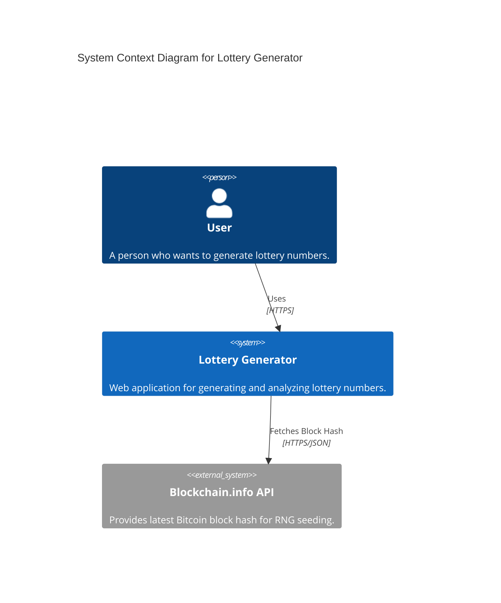
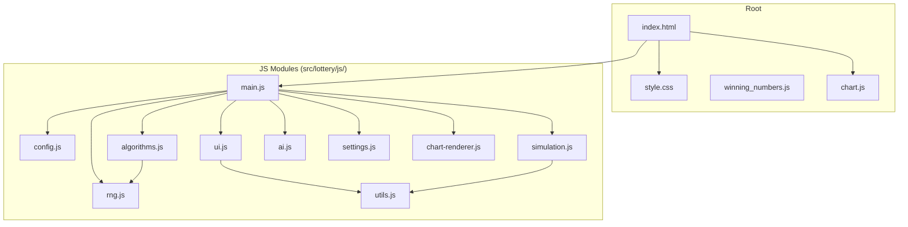
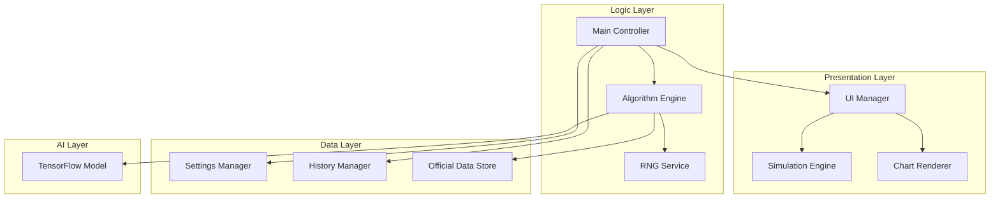
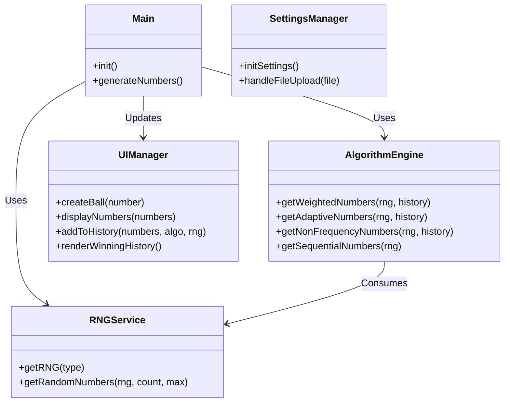
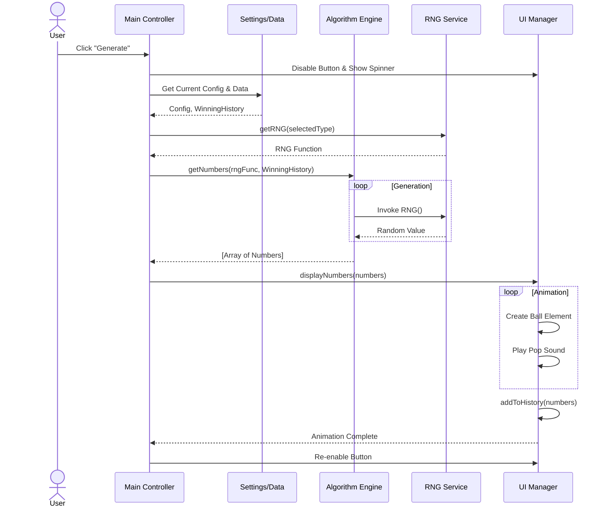

# Architecture Documentation

## Overview
The **Lottery Generator** is a client-side web application designed to generate, analyze, and simulate lottery numbers (Lotto 6/45). It operates entirely in the browser without a backend server, utilizing modern JavaScript (ES6+) and HTML5 features.

## Project Structure

```
src/lottery/
├── index.html              # Main entry point and UI structure
├── style.css               # Global styles and responsive design
├── winning_numbers.js      # Historical data (Official Winning Numbers)
├── chart.js                # Chart.js library (Vendor)
├── js/                     # Modular JavaScript Logic
│   ├── main.js             # Application entry point and event orchestration
│   ├── config.js           # Global configuration and constants
│   ├── ui.js               # UI manipulation and component rendering
│   ├── algorithms.js       # Number generation algorithms (Weighted, Trend, AI)
│   ├── rng.js              # Random Number Generator implementations
│   ├── simulation.js       # Physics-based visual simulation (Canvas)
│   ├── ai.js               # TensorFlow.js model training and prediction
│   ├── settings.js         # User settings and data management
│   ├── chart-renderer.js   # Chart.js integration and rendering logic
│   └── utils.js            # Helper functions (Math, DOM helpers)
└── ...                     # Python scripts for data crawling (Offline tools)
```

## Core Components

### 1. Data Layer
- **`winning_numbers.js`**: Stores the official history of winning numbers as a JavaScript array. This file acts as the primary database.
- **`settings.js`**: Manages data ingestion. It allows users to switch between the default server data and custom Excel (`.xls`) file uploads. It parses HTML tables from Excel files client-side.

### 2. Logic Layer
- **`algorithms.js`**: Contains the core business logic for generating numbers.
    - **Weighted**: Probabilistic selection based on historical frequency.
    - **Adaptive (Trend)**: Weights recent numbers higher with a decay factor.
    - **Non-Frequency (Cold)**: Inverse weighting to favor numbers that haven't appeared recently.
    - **Sequential (AI)**: Markov Chain-based transition probability or Deep Learning model.
- **`rng.js`**: Provides various sources of randomness.
    - **PRNG**: Standard `Math.random()`.
    - **Secure**: `crypto.getRandomValues()`.
    - **VRF**: Simulated Verifiable Random Function.
    - **Blockchain**: Seeds RNG with the latest Bitcoin block hash (via external API).

### 3. Presentation Layer
- **`ui.js`**: Handles DOM updates, tab navigation, and history display. It manages the "Single Page Application" feel by toggling visibility of views.
- **`simulation.js`**: Renders a 2D physics simulation of the lottery drum using HTML5 Canvas. It visualizes the mixing and extraction process.
- **`chart-renderer.js`**: Visualizes number frequency using Chart.js.

### 4. AI Layer
- **`ai.js`**: Uses **TensorFlow.js** to train a sequential model (LSTM/Dense) directly in the browser. It learns patterns from the loaded history to predict the next sequence.

## Data Flow

1.  **Initialization**: `main.js` loads, initializes UI components, and fetches data from `winning_numbers.js`.
2.  **User Interaction**: User selects an algorithm and RNG source via the Sidebar.
3.  **Generation**:
    - `main.js` calls the appropriate function in `algorithms.js`.
    - `algorithms.js` requests random numbers from `rng.js`.
    - `rng.js` returns a normalized float [0, 1).
4.  **Display**:
    - Generated numbers are passed to `ui.js`.
    - `ui.js` creates DOM elements (balls) and animates them.
    - `simulation.js` (if active) visualizes the process.
5.  **History**: The result is saved to `localStorage` and displayed in the history log.

## Key Design Decisions

-   **Client-Side Only**: To ensure privacy and ease of deployment (GitHub Pages), the app runs 100% in the browser.
-   **Modular Architecture**: Logic is split into specialized files (`rng`, `ui`, `algo`) to maintain code quality and testability.
-   **Reactive UI**: The UI updates immediately upon data changes (e.g., file upload) without page reloads, using DOM manipulation.
-   **Offline Capability**: Core features work offline, with graceful degradation for online-only features (Blockchain RNG).

## Diagrams

### 1. Context Diagram
This diagram illustrates the system boundary and its interactions with external entities.



### 2. Module View
High-level organization of the source code.



### 3. Component View
Logical breakdown of the application's internal components.



### 4. Class Diagram
Representation of the key modules as classes/objects.



### 5. Sequence Diagram
Flow of events when the user clicks "Generate".


